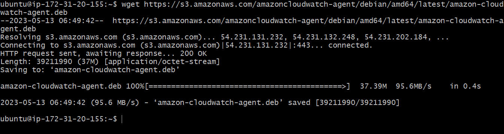
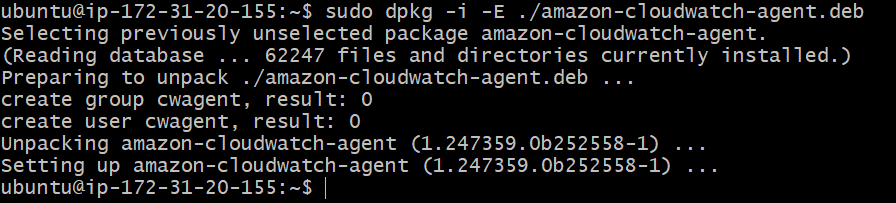
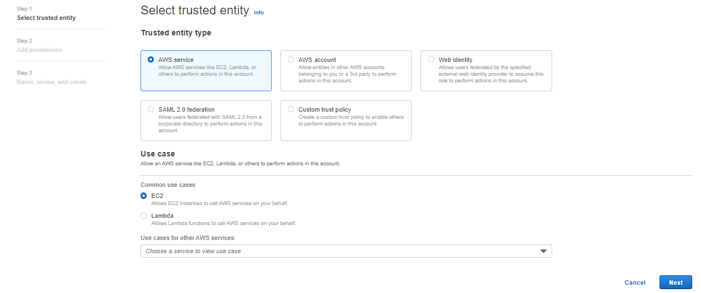
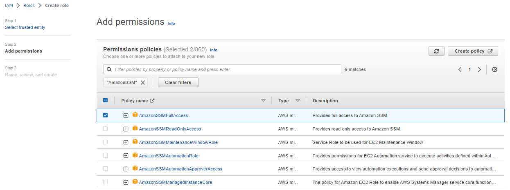
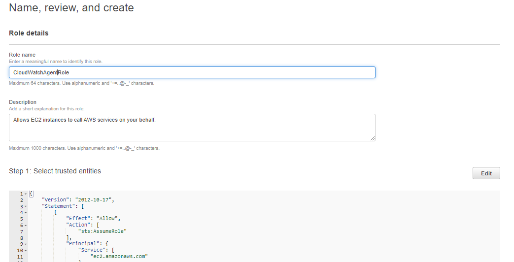
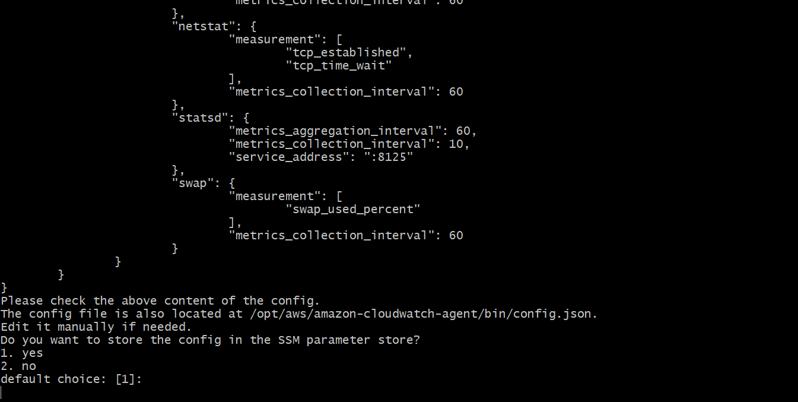

# Installing and Configuring CloudWatch Agent on EC2

## Why do we need cloudwatch agent?

Most AWS Services have built in support for cloudwatch to collect and store operational data. In the case of EC2, Amazon EC2 sends metrics to CloudWatch such as CPU Utilization, Network IN/Out etc.

Let's say you want to monitor an application running inside the EC2, That is where cloudwatch agent comes into play.

## Steps to download and configure cloudwatch agent

### Step 1:

Download the cloudwatch agent package from https://s3.amazonaws.com/amazoncloudwatch-agent/debian/amd64/latest/amazon-cloudwatch-agent.deb

Run the following command:

```
wget https://s3.amazonaws.com/amazoncloudwatch-agent/debian/amd64/latest/amazon-cloudwatch-agent.deb
```



if you downloaded RPM package, change to the directory containing the package and enter the following:

```
sudo dpkg -i -E ./amazon-cloudwatch-agent.deb
```


### Step2:

Attact IAM Role to give an instance access to SSM Parameter store and cloudwatch log permissions.

### To create the IAM role necessary to run the CloudWatch agent on EC2 instances

1. Sign in to the AWS Management Console and open the IAM console at https://console.aws.amazon.com/iam/.

2. In the navigation pane on the left, choose Roles and then Create role.

3. Make sure that AWS service is selected under Trusted entity type.

4. For Use case, choose EC2 under Common use cases,

Choose Next.

5. In the list of policies, select the check box next to CloudWatchAgentServerPolicy and AmazonSSMFullAccess. If necessary, use the search box to find the policy.

6. Choose Next.

7. In Role name, enter a name for the role, such as CloudWatchAgentServerRole. Optionally give it a description. Then choose Create role.

8. Attact a role to an EC2 instance.

The role is now created.







### Step 3:
Start the cloudwatch agent configuration wizard

```
sudo /opt/aws/amazon-cloudwatch-agent/bin/amazon-cloudwatch-agent-config-wizard
```

[Press Enter to use Default settings](images/image-6.PNG)



### Step 4:

Install the CollectD agent

```
sudo mkdir /usr/share/collectd
```
```
sudo touch /usr/share/collectd/types.db
```

### Step 5:

Start the cloudwatch Agent with SSM paramter store configuration

```
sudo /opt/aws/amazon-cloudwatch-agent/bin/amazon-cloudwatch-agent-ctl -a fetch-config -m ec2 -s -c ssm:AmazonCloudWatch-linux
```